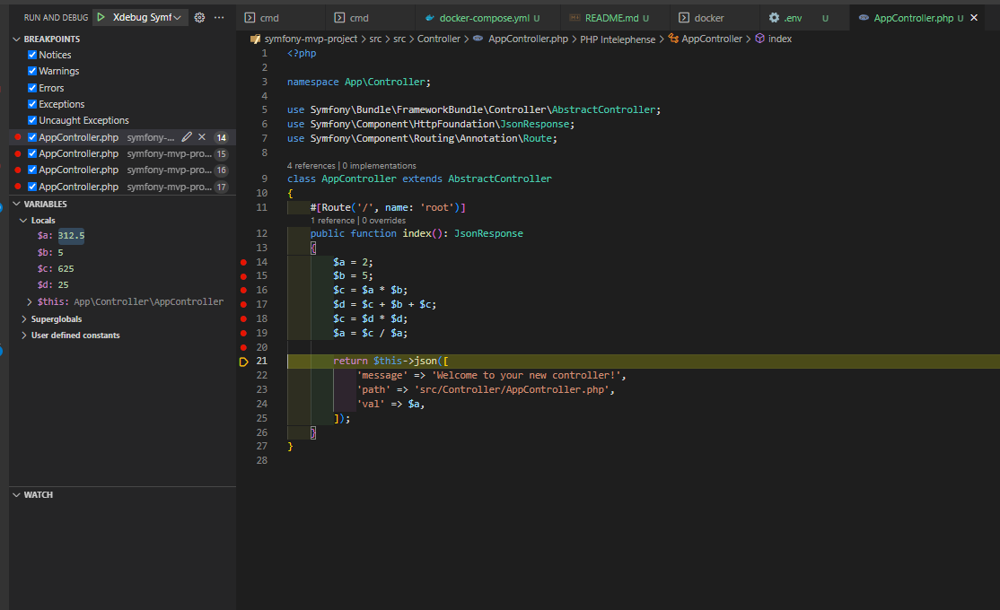

# Notes

- URL : `http://127.0.0.1:8881/`
- Profiler : `http://127.0.0.1:8881/_profiler`
- Permission issues on cache repo : `chown -R root:root var/cache/`
- Forcing cache clear : `rm -rf ./src/var/cache/dev/`
- MongoUI : `http://localhost:4321/`
- CLI
- - `php bin/console dba:cache:init`
- - `php bin/console app:mongo:init clear`
- - `php bin/console app:mongo:find`
- - `php bin/console app:mongo:find 645e6f7d0429d100de0c5a77`
- - `php bin/console app:graphql:query`

## MongoDB

- `docker-compose.yml` - added `mongo-db` & `mongo-gui`
- `Dockerfile` - php extension : `mongodb`
- Install composer package : `composer require doctrine/mongodb-odm-bundle`
- `AppController` - Persisting in MongoDB

```php
public function index(DocumentManager $dm): JsonResponse
{

    $product = new Product();
    $product
        ->setName('A Foo Bar')
        ->setPrice('19.99')
    ;

    $dm->persist($product);
    $dm->flush();
    ...
```

## DBA

- Pak8ge : `https://github.com/fadilxcoder/dba-php-packagist.git`

--- 
## Xdebug / VS Code


```
zend_extension=xdebug
[xdebug]
xdebug.mode=develop,debug
xdebug.client_host=host.docker.internal
xdebug.start_with_request=yes
```

- `docker-compose.yml`

```
    extra_hosts:
      - "host.docker.internal:host-gateway"
```

- `launch.json`

```
{
    "version": "0.2.0",
    "configurations": [
        {
            "name": "Xdebug Symfony MVP",
            "type": "php",
            "request": "launch",
            "port": 9003,
            "pathMappings": {
                "/var/www/html/": "${workspaceFolder}/src/"
            }
        }
    ]
}
```


